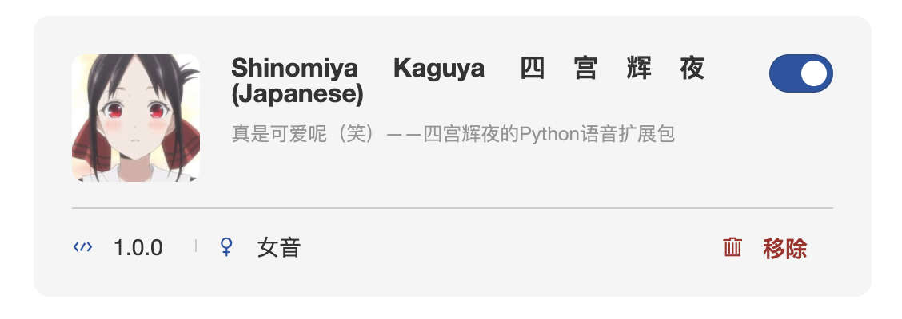
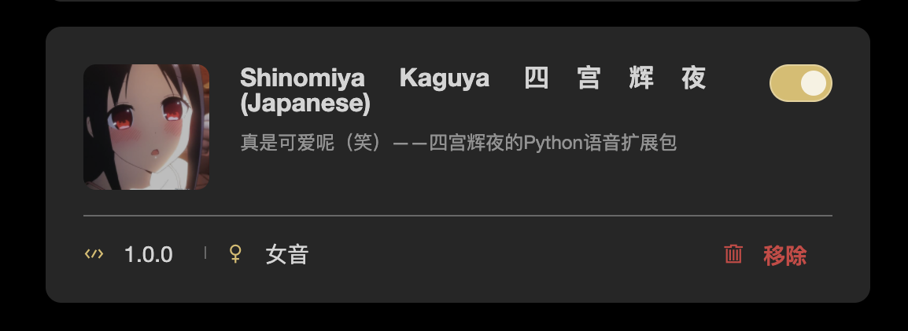

<h1 align="center">
辉夜 ⭐️ rainbow-fart ⭐️ 语音包
</h1>

  
  

<strong>「真是可爱呢（笑）」——《辉夜大小姐想让我告白：天才们的恋爱头脑战》古贺葵/四宫辉夜</strong>

---

这是 vscode 彩虹屁🌈插件 [vscode-rainbow-fart](https://github.com/SaekiRaku/vscode-rainbow-fart) 的语音扩展包，语言为python。

## Preview

语音文件: [voices/](./voices/)

## Install

在 vscode-rainbow-fart(v1.2.3) 中引入语音包是需要打包成 zip 然后引用的，

**本项目已经提供了打包好的文件，可以直接在 [Releases](https://github.com/Currycurrycurry/Shinomiya-Kaguya-rainbow-fart/releases/) 中下载最新版 zip；**

(或者作为开发者从[本仓库](https://github.com/Currycurrycurry/Shinomiya-Kaguya-rainbow-fart) clone 后自己手动把相关资源打包成 zip。

然后在本地 vscode 启动的 rainbow-fart 配置页面中 `Settings` -> `Voice Packages` -> `Import` 中导入 zip，导入后需要点 enable 开关开启使用；

## Ref

- [vscode-rainbow-fart](https://github.com/SaekiRaku/vscode-rainbow-fart)

## Thanks

感谢帮忙翻译的阿语同学和@zqzten（拯救了本日语N∞苦手

